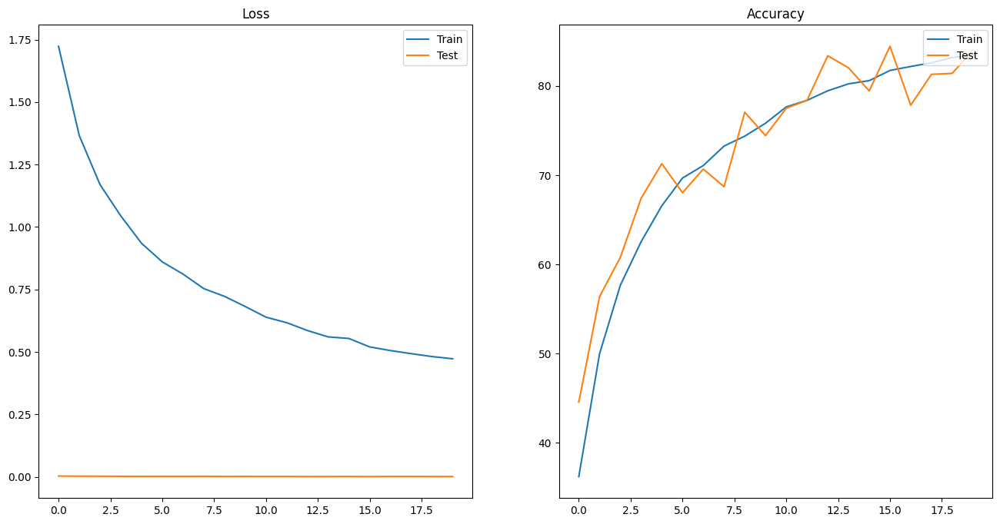
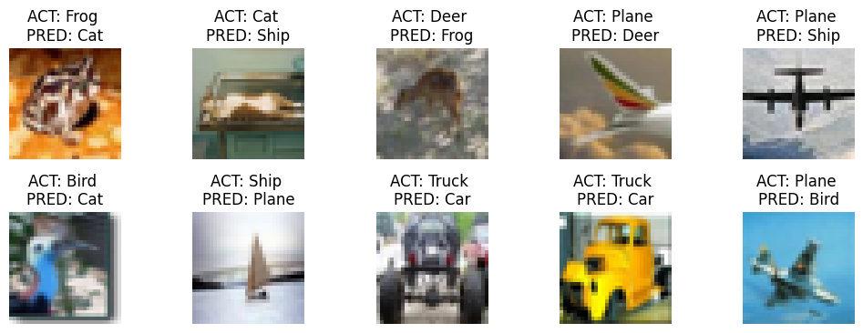
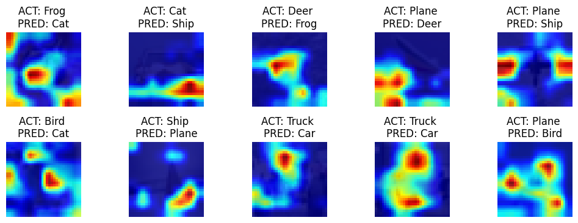

# [Assignment 11](https://canvas.instructure.com/courses/6743641/quizzes/15009662?module_item_id=89926436)

## Table of Contents

- [Assignment 11](#assignment-11)
  - [Table of Contents](#table-of-contents)
  - [Assignment Objectives](#assignment-objectives)
  - [Code Overview](#code-overview)
  - [Image Augmentation](#image-augmentation)
  - [Model Parameters](#model-parameters)
  - [LR Finder](#lr-finder)
  - [Training logs](#training-logs)
  - [Test and Train Metrics](#test-and-train-metrics)
  - [Misclassified Images](#misclassified-images)
  - [GradCAM Images (Misclassified)](#gradcam-images-misclassified)

<br>

## Assignment Objectives

Achieve following objectives

- [x] Use GradCAM
- [x] Use 20 epochs and resnet18 model
- [x] Use 1 cycle LR and LR finder
- [x] Use Git to pull all modules automatically
- [x] Minimal code in main notebook

<br>

## Code Overview

To run the code, download the Notebook. Then just run the Notebook and other modules will be automatically imported. The code is structured in a modular way as below:

- **Modules**
  - [dataset.py](modules/dataset.py)
    - Function to download and split CIFAR10 data to test and train - `split_cifar_data()`
    - Function that creates the required test and train transforms compatible with Albumentations - `apply_cifar_image_transformations()`
    - Class that applies the required transforms to dataset - CIFAR10Transforms()
    - Function to calculate mean and standard deviation of the data to normalize tensors - `calculate_mean_std()`
    - Get train and test dataloaders - `get_cifar_dataloaders()`
  - [resnet.py](models/resnet.py)
    - ResNet18 and ResNet34 models
    - Detailed model summary - `detailed_model_summary()`
  - [trainer.py](modules/trainer.py)
    - Train and test the model given the optimizer and criterion - `train_model()`, `test_model()`, `train_and_test_model()`
    - Use LR Finder to find the best starting learning rate - `find_optimal_lr()`
  - [utils.py](modules/utils.py)
    - Function that detects and returns correct device including GPU and CPU - `get_device()`
    - Given a set of predictions and labels, return the cumulative correct count - `get_correct_prediction_count()`
    - Function to save model, epoch, optimizer, scheduler, loss and batch size - `save_model()`
    - Pretty print training log - `pretty_print_metrics()`
  - [visualize.py](modules/visualize.py)
    - Given a normalize image along with mean and standard deviation for each channels, convert it back - `convert_back_image()`
    - Plot sample training images along with the labels - `plot_sample_training_images()`
    - Plot train and test metrics - `plot_train_test_metrics()`
    - Plot incorrectly classified images along with ground truth and predicted classes - `plot_misclassified_images()`
    - Show gradcam for misclassified images - `plot_gradcam_images()`
- **[Notebook](<ERA V1 - Viraj - Assignment 11.ipynb>)**
  - **Flow**
    - Install and import required libraries
    - Fetch all required modules automatically using git
    - Define various script and model parameters
    - Get device and workers
    - Obtain the data loaders and class labels
    - Display sample images from the training data post transformations
    - Load model to device
    - Show model summary along with tensor size after each block
    - Use LR finder and Once cycle policy
    - Start training and compute various train and test metrics, save best model after each epoch
    - Plot accuracy and loss metrics, also print them in a human readable format
    - Save model after final epoch
    - Show incorrectly predicted images along with actual and predicted labels
    - Show GradCAM for incorrectly predicted images

<br>

## Image Augmentation

Sample images after Augmentation


## Model Parameters

**Layer Structure**

```
PrepLayer
	 torch.Size([1, 64, 32, 32])

Layer 1
	 torch.Size([1, 64, 32, 32])

Layer 2
	 torch.Size([1, 128, 16, 16])

Layer 3
	 torch.Size([1, 256, 8, 8])

Layer 4
	 torch.Size([1, 512, 4, 4])

Post GAP
	 torch.Size([1, 512, 1, 1])

Reshape before FC
	 torch.Size([1, 512])

After FC
	 torch.Size([1, 10])
```

**Parameters**

```
========================================================================================================================
Layer (type:depth-idx)                   Input Shape      Kernel Shape     Output Shape     Param #          Trainable
========================================================================================================================
ResNet                                   [1, 3, 32, 32]   --               [1, 10]          --               True
├─Conv2d: 1-1                            [1, 3, 32, 32]   [3, 3]           [1, 64, 32, 32]  1,728            True
├─BatchNorm2d: 1-2                       [1, 64, 32, 32]  --               [1, 64, 32, 32]  128              True
├─Sequential: 1-3                        [1, 64, 32, 32]  --               [1, 64, 32, 32]  --               True
│    └─BasicBlock: 2-1                   [1, 64, 32, 32]  --               [1, 64, 32, 32]  --               True
│    │    └─Conv2d: 3-1                  [1, 64, 32, 32]  [3, 3]           [1, 64, 32, 32]  36,864           True
│    │    └─BatchNorm2d: 3-2             [1, 64, 32, 32]  --               [1, 64, 32, 32]  128              True
│    │    └─Conv2d: 3-3                  [1, 64, 32, 32]  [3, 3]           [1, 64, 32, 32]  36,864           True
│    │    └─BatchNorm2d: 3-4             [1, 64, 32, 32]  --               [1, 64, 32, 32]  128              True
│    │    └─Sequential: 3-5              [1, 64, 32, 32]  --               [1, 64, 32, 32]  --               --
│    └─BasicBlock: 2-2                   [1, 64, 32, 32]  --               [1, 64, 32, 32]  --               True
│    │    └─Conv2d: 3-6                  [1, 64, 32, 32]  [3, 3]           [1, 64, 32, 32]  36,864           True
│    │    └─BatchNorm2d: 3-7             [1, 64, 32, 32]  --               [1, 64, 32, 32]  128              True
│    │    └─Conv2d: 3-8                  [1, 64, 32, 32]  [3, 3]           [1, 64, 32, 32]  36,864           True
│    │    └─BatchNorm2d: 3-9             [1, 64, 32, 32]  --               [1, 64, 32, 32]  128              True
│    │    └─Sequential: 3-10             [1, 64, 32, 32]  --               [1, 64, 32, 32]  --               --
├─Sequential: 1-4                        [1, 64, 32, 32]  --               [1, 128, 16, 16] --               True
│    └─BasicBlock: 2-3                   [1, 64, 32, 32]  --               [1, 128, 16, 16] --               True
│    │    └─Conv2d: 3-11                 [1, 64, 32, 32]  [3, 3]           [1, 128, 16, 16] 73,728           True
│    │    └─BatchNorm2d: 3-12            [1, 128, 16, 16] --               [1, 128, 16, 16] 256              True
│    │    └─Conv2d: 3-13                 [1, 128, 16, 16] [3, 3]           [1, 128, 16, 16] 147,456          True
│    │    └─BatchNorm2d: 3-14            [1, 128, 16, 16] --               [1, 128, 16, 16] 256              True
│    │    └─Sequential: 3-15             [1, 64, 32, 32]  --               [1, 128, 16, 16] 8,448            True
│    └─BasicBlock: 2-4                   [1, 128, 16, 16] --               [1, 128, 16, 16] --               True
│    │    └─Conv2d: 3-16                 [1, 128, 16, 16] [3, 3]           [1, 128, 16, 16] 147,456          True
│    │    └─BatchNorm2d: 3-17            [1, 128, 16, 16] --               [1, 128, 16, 16] 256              True
│    │    └─Conv2d: 3-18                 [1, 128, 16, 16] [3, 3]           [1, 128, 16, 16] 147,456          True
│    │    └─BatchNorm2d: 3-19            [1, 128, 16, 16] --               [1, 128, 16, 16] 256              True
│    │    └─Sequential: 3-20             [1, 128, 16, 16] --               [1, 128, 16, 16] --               --
├─Sequential: 1-5                        [1, 128, 16, 16] --               [1, 256, 8, 8]   --               True
│    └─BasicBlock: 2-5                   [1, 128, 16, 16] --               [1, 256, 8, 8]   --               True
│    │    └─Conv2d: 3-21                 [1, 128, 16, 16] [3, 3]           [1, 256, 8, 8]   294,912          True
│    │    └─BatchNorm2d: 3-22            [1, 256, 8, 8]   --               [1, 256, 8, 8]   512              True
│    │    └─Conv2d: 3-23                 [1, 256, 8, 8]   [3, 3]           [1, 256, 8, 8]   589,824          True
│    │    └─BatchNorm2d: 3-24            [1, 256, 8, 8]   --               [1, 256, 8, 8]   512              True
│    │    └─Sequential: 3-25             [1, 128, 16, 16] --               [1, 256, 8, 8]   33,280           True
│    └─BasicBlock: 2-6                   [1, 256, 8, 8]   --               [1, 256, 8, 8]   --               True
│    │    └─Conv2d: 3-26                 [1, 256, 8, 8]   [3, 3]           [1, 256, 8, 8]   589,824          True
│    │    └─BatchNorm2d: 3-27            [1, 256, 8, 8]   --               [1, 256, 8, 8]   512              True
│    │    └─Conv2d: 3-28                 [1, 256, 8, 8]   [3, 3]           [1, 256, 8, 8]   589,824          True
│    │    └─BatchNorm2d: 3-29            [1, 256, 8, 8]   --               [1, 256, 8, 8]   512              True
│    │    └─Sequential: 3-30             [1, 256, 8, 8]   --               [1, 256, 8, 8]   --               --
├─Sequential: 1-6                        [1, 256, 8, 8]   --               [1, 512, 4, 4]   --               True
│    └─BasicBlock: 2-7                   [1, 256, 8, 8]   --               [1, 512, 4, 4]   --               True
│    │    └─Conv2d: 3-31                 [1, 256, 8, 8]   [3, 3]           [1, 512, 4, 4]   1,179,648        True
│    │    └─BatchNorm2d: 3-32            [1, 512, 4, 4]   --               [1, 512, 4, 4]   1,024            True
│    │    └─Conv2d: 3-33                 [1, 512, 4, 4]   [3, 3]           [1, 512, 4, 4]   2,359,296        True
│    │    └─BatchNorm2d: 3-34            [1, 512, 4, 4]   --               [1, 512, 4, 4]   1,024            True
│    │    └─Sequential: 3-35             [1, 256, 8, 8]   --               [1, 512, 4, 4]   132,096          True
│    └─BasicBlock: 2-8                   [1, 512, 4, 4]   --               [1, 512, 4, 4]   --               True
│    │    └─Conv2d: 3-36                 [1, 512, 4, 4]   [3, 3]           [1, 512, 4, 4]   2,359,296        True
│    │    └─BatchNorm2d: 3-37            [1, 512, 4, 4]   --               [1, 512, 4, 4]   1,024            True
│    │    └─Conv2d: 3-38                 [1, 512, 4, 4]   [3, 3]           [1, 512, 4, 4]   2,359,296        True
│    │    └─BatchNorm2d: 3-39            [1, 512, 4, 4]   --               [1, 512, 4, 4]   1,024            True
│    │    └─Sequential: 3-40             [1, 512, 4, 4]   --               [1, 512, 4, 4]   --               --
├─Linear: 1-7                            [1, 512]         --               [1, 10]          5,130            True
========================================================================================================================
Total params: 11,173,962
Trainable params: 11,173,962
Non-trainable params: 0
Total mult-adds (M): 555.43
========================================================================================================================
Input size (MB): 0.01
Forward/backward pass size (MB): 9.83
Params size (MB): 44.70
Estimated Total Size (MB): 54.54
========================================================================================================================

```

<br>

## LR Finder

Suggested Max LR


<br>

## Training logs

```
Batch size: 512, Total epochs: 20


Epoch 1
Train: Loss=1.4337, Batch=97, Accuracy=36.21: 100%|██████████| 98/98 [00:41<00:00,  2.35it/s]
Test set: Average loss: 0.0030,  Accuracy: 44.56%


Epoch 2
Train: Loss=1.1994, Batch=97, Accuracy=49.98: 100%|██████████| 98/98 [00:41<00:00,  2.35it/s]
Test set: Average loss: 0.0025,  Accuracy: 56.39%


Epoch 3
Train: Loss=1.1137, Batch=97, Accuracy=57.65: 100%|██████████| 98/98 [00:41<00:00,  2.36it/s]
Test set: Average loss: 0.0023,  Accuracy: 60.78%


Epoch 4
Train: Loss=1.0217, Batch=97, Accuracy=62.53: 100%|██████████| 98/98 [00:41<00:00,  2.35it/s]
Test set: Average loss: 0.0019,  Accuracy: 67.39%


Epoch 5
Train: Loss=0.8932, Batch=97, Accuracy=66.57: 100%|██████████| 98/98 [00:41<00:00,  2.34it/s]
Test set: Average loss: 0.0017,  Accuracy: 71.29%


Epoch 6
Train: Loss=0.8213, Batch=97, Accuracy=69.68: 100%|██████████| 98/98 [00:41<00:00,  2.35it/s]
Test set: Average loss: 0.0019,  Accuracy: 68.04%


Epoch 7
Train: Loss=0.7661, Batch=97, Accuracy=71.08: 100%|██████████| 98/98 [00:41<00:00,  2.35it/s]
Test set: Average loss: 0.0017,  Accuracy: 70.69%


Epoch 8
Train: Loss=0.7228, Batch=97, Accuracy=73.26: 100%|██████████| 98/98 [00:41<00:00,  2.34it/s]
Test set: Average loss: 0.0019,  Accuracy: 68.71%


Epoch 9
Train: Loss=0.7051, Batch=97, Accuracy=74.38: 100%|██████████| 98/98 [00:41<00:00,  2.35it/s]
Test set: Average loss: 0.0014,  Accuracy: 77.06%


Epoch 10
Train: Loss=0.7024, Batch=97, Accuracy=75.83: 100%|██████████| 98/98 [00:41<00:00,  2.35it/s]
Test set: Average loss: 0.0016,  Accuracy: 74.44%


Epoch 11
Train: Loss=0.6908, Batch=97, Accuracy=77.65: 100%|██████████| 98/98 [00:41<00:00,  2.35it/s]
Test set: Average loss: 0.0014,  Accuracy: 77.51%


Epoch 12
Train: Loss=0.5731, Batch=97, Accuracy=78.39: 100%|██████████| 98/98 [00:41<00:00,  2.35it/s]
Test set: Average loss: 0.0014,  Accuracy: 78.39%


Epoch 13
Train: Loss=0.5198, Batch=97, Accuracy=79.46: 100%|██████████| 98/98 [00:41<00:00,  2.34it/s]
Test set: Average loss: 0.0010,  Accuracy: 83.39%


Epoch 14
Train: Loss=0.6079, Batch=97, Accuracy=80.24: 100%|██████████| 98/98 [00:41<00:00,  2.35it/s]
Test set: Average loss: 0.0011,  Accuracy: 82.04%


Epoch 15
Train: Loss=0.6192, Batch=97, Accuracy=80.60: 100%|██████████| 98/98 [00:41<00:00,  2.35it/s]
Test set: Average loss: 0.0013,  Accuracy: 79.45%


Epoch 16
Train: Loss=0.5042, Batch=97, Accuracy=81.74: 100%|██████████| 98/98 [00:41<00:00,  2.35it/s]
Test set: Average loss: 0.0009,  Accuracy: 84.45%


Epoch 17
Train: Loss=0.5182, Batch=97, Accuracy=82.19: 100%|██████████| 98/98 [00:41<00:00,  2.35it/s]
Test set: Average loss: 0.0014,  Accuracy: 77.85%


Epoch 18
Train: Loss=0.4672, Batch=97, Accuracy=82.61: 100%|██████████| 98/98 [00:41<00:00,  2.36it/s]
Test set: Average loss: 0.0013,  Accuracy: 81.31%


Epoch 19
Train: Loss=0.5498, Batch=97, Accuracy=83.19: 100%|██████████| 98/98 [00:41<00:00,  2.36it/s]
Test set: Average loss: 0.0011,  Accuracy: 81.42%


Epoch 20
Train: Loss=0.4355, Batch=97, Accuracy=83.44: 100%|██████████| 98/98 [00:41<00:00,  2.35it/s]
Test set: Average loss: 0.0010,  Accuracy: 84.03%
```

<br>

## Test and Train Metrics

Accuracy and Loss Metrics



<br>

## Misclassified Images

10 samples of misclassified images



## GradCAM Images (Misclassified)

**Code**

```py
# Function to plot gradcam for misclassified images using pytorch_grad_cam
def plot_gradcam_images(
    model,
    data,
    class_label,
    target_layers,
    device,
    targets=None,
    num_images=10,
    image_weight=0.25,
):
    """Show gradcam for misclassified images"""

    # Flag to enable cuda
    use_cuda = device == "cuda"

    # Calculate the number of images to plot
    num_images = min(num_images, len(data["ground_truths"]))
    # calculate the number of rows and columns to plot
    num_cols = 5
    num_rows = int(np.ceil(num_images / num_cols))

    # Initialize a subplot with the required number of rows and columns
    fig, axs = plt.subplots(num_rows, num_cols, figsize=(num_cols * 2, num_rows * 2))

    # Initialize the GradCAM object
    # https://github.com/jacobgil/pytorch-grad-cam/blob/master/pytorch_grad_cam/grad_cam.py
    # https://github.com/jacobgil/pytorch-grad-cam/blob/master/pytorch_grad_cam/base_cam.py
    cam = GradCAM(model=model, target_layers=target_layers, use_cuda=use_cuda)

    # Iterate through the images and plot them in the grid along with class labels
    for img_index in range(1, num_images + 1):
        # Extract elements from the data dictionary
        # Get the ground truth and predicted labels for the image
        label = data["ground_truths"][img_index - 1].cpu().item()
        pred = data["predicted_vals"][img_index - 1].cpu().item()
        # Get the image
        image = data["images"][img_index - 1].cpu()

        # Get the GradCAM output
        # https://github.com/jacobgil/pytorch-grad-cam/blob/master/pytorch_grad_cam/utils/model_targets.py
        grad_cam_output = cam(
            input_tensor=image.unsqueeze(0),
            targets=targets
            # aug_smooth=True,
            # eigen_smooth=True,
        )
        grad_cam_output = grad_cam_output[0, :]

        # Overlay gradcam on top of numpy image
        overlayed_image = show_cam_on_image(
            convert_back_image(image),
            grad_cam_output,
            use_rgb=True,
            image_weight=image_weight,
        )

        # Plot the image
        plt.subplot(num_rows, num_cols, img_index)
        plt.tight_layout()
        plt.axis("off")
        plt.imshow(overlayed_image)
        plt.title(f"""ACT: {class_label[label]} \nPRED: {class_label[pred]}""")
        plt.xticks([])
        plt.yticks([])
    return fig, axs

```

**Image**

10 sample of misclassified images with an overlay of GradCAM



<br>
