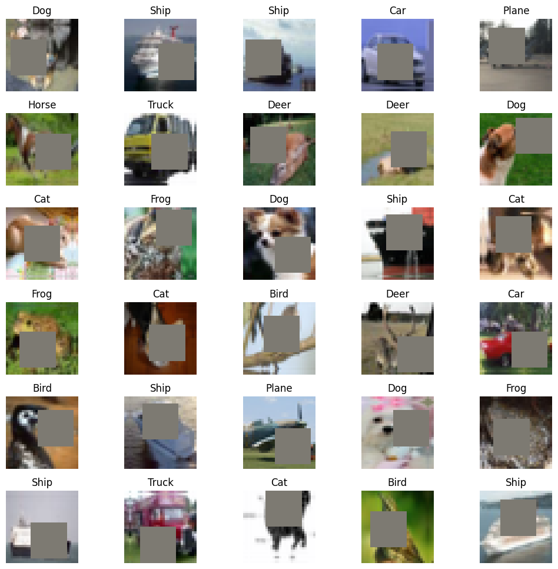
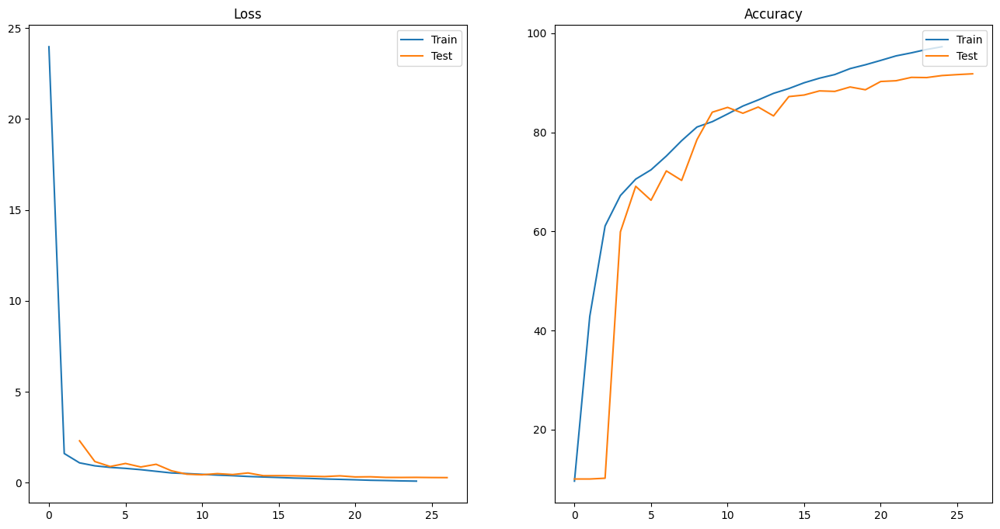
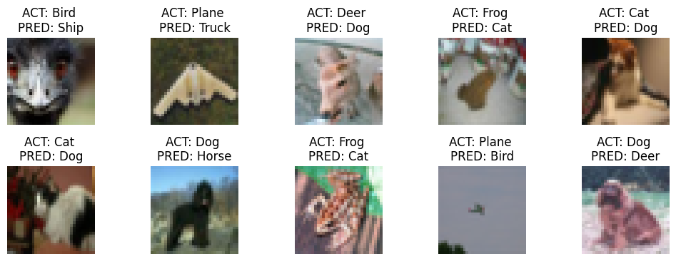

# [Assignment 12](https://canvas.instructure.com/courses/6743641/quizzes/15067423?module_item_id=90299422)

## Table of Contents

- [Assignment 12](#assignment-12)
  - [Table of Contents](#table-of-contents)
  - [Assignment Objectives](#assignment-objectives)
  - [Inference App](#inference-app)
  - [Code Overview](#code-overview)
  - [Image Augmentation](#image-augmentation)
  - [Model Parameters](#model-parameters)
  - [Training logs](#training-logs)
  - [Test and Train Metrics](#test-and-train-metrics)
  - [Misclassified Images](#misclassified-images)
  - [GradCAM Images (Misclassified)](#gradcam-images-misclassified)

<br>

## Assignment Objectives

Achieve following objectives

- [x] Port model Code to Lightning
- [x] Build Gradio App

## Inference App

- [App](https://huggingface.co/spaces/nviraj/ERA-V1-Assignment12)
- [Readme](https://huggingface.co/spaces/nviraj/ERA-V1-Assignment12/blob/main/README.md)
- [Files](https://huggingface.co/spaces/nviraj/ERA-V1-Assignment12/tree/main)

<br>

## Code Overview

To run the code, download the Notebook. Then just run the Notebook and other modules will be automatically imported.
The Pytorch code was converted to Pytorch Lightning Code to reduce boilerplate code and improve training speed.

The code is structured in a modular way as below:

- **Modules**
  - [dataset.py](modules/dataset.py)
    - Function that creates the required test and train transforms compatible with Albumentations - `apply_cifar_image_transformations()`
    - Class that applies the required transforms to dataset - CIFAR10Transforms()
    - Function to calculate mean and standard deviation of the data to normalize tensors - `calculate_mean_std()`
  - [lightning_dataset.py](modules/lightning_dataset.py)
    - `CIFARDataModule` which is a class of type `pl.LightningDataModule`
  - [custom_resnet.py](models/custom_resnet.py)
    - `CustomResNet` model of class `pl.LightningModule`
    - Detailed model summary - `detailed_model_summary()`
  - [trainer.py](modules/trainer.py)
    - Train and test the model given the optimizer and criterion - `train_and_test_model()`
  - [utils.py](modules/utils.py)
    - Function to save model, epoch, optimizer, scheduler, loss and batch size - `save_model()`
    - Pretty print training log - `pretty_print_metrics()`
  - [visualize.py](modules/visualize.py)
    - Given a normalize image along with mean and standard deviation for each channels, convert it back - `convert_back_image()`
    - Plot sample training images along with the labels - `plot_sample_training_images()`
    - Plot train and test metrics - `plot_train_test_metrics()`
    - Plot incorrectly classified images along with ground truth and predicted classes - `plot_misclassified_images()`
    - Show gradcam for misclassified images - `plot_gradcam_images()`
  - [config.py](modules/config.py)
    - Contains all config variables needed for the script
- **[Notebook](<ERA V1 - Viraj - Assignment 12.ipynb>)**
  - **Flow**
    - Install and import required libraries
    - Fetch all required modules automatically using git
    - Display sample images from the training data post transformations
    - Show model summary along with tensor size after each block
    - Start training and compute various train and test metrics, save best model after each epoch
    - Plot accuracy and loss metrics, also print them in a human readable format
    - Show incorrectly predicted images along with actual and predicted labels
    - Show GradCAM for incorrectly predicted images
    - Show tensorboard for metrics

<br>

## Image Augmentation

Sample images after Augmentation



<br>

## Model Parameters

**Layer Structure**

```
PrepLayer
	 torch.Size([1, 64, 32, 32])

Layer 1, X
	 torch.Size([1, 128, 16, 16])

Layer 1, R1
	 torch.Size([1, 128, 16, 16])

Layer 1, X + R1
	 torch.Size([1, 128, 16, 16])

Layer 2
	 torch.Size([1, 256, 8, 8])

Layer 3, X
	 torch.Size([1, 512, 4, 4])

Layer 3, R2
	 torch.Size([1, 512, 4, 4])

Layer 3, X + R2
	 torch.Size([1, 512, 4, 4])

Max Pooling
	 torch.Size([1, 512, 1, 1])

Reshape before FC
	 torch.Size([1, 512])

After FC
	 torch.Size([1, 10])
```

**Parameters**

```
========================================================================================================================
Layer (type:depth-idx)                   Input Shape      Kernel Shape     Output Shape     Param #          Trainable
========================================================================================================================
CustomResNet                             [1, 3, 32, 32]   --               [1, 10]          --               True
├─Sequential: 1-1                        [1, 3, 32, 32]   --               [1, 64, 32, 32]  --               True
│    └─Conv2d: 2-1                       [1, 3, 32, 32]   [3, 3]           [1, 64, 32, 32]  1,728            True
│    └─BatchNorm2d: 2-2                  [1, 64, 32, 32]  --               [1, 64, 32, 32]  128              True
│    └─ReLU: 2-3                         [1, 64, 32, 32]  --               [1, 64, 32, 32]  --               --
│    └─Dropout: 2-4                      [1, 64, 32, 32]  --               [1, 64, 32, 32]  --               --
├─Sequential: 1-2                        [1, 64, 32, 32]  --               [1, 128, 16, 16] --               True
│    └─Conv2d: 2-5                       [1, 64, 32, 32]  [3, 3]           [1, 128, 32, 32] 73,728           True
│    └─MaxPool2d: 2-6                    [1, 128, 32, 32] 2                [1, 128, 16, 16] --               --
│    └─BatchNorm2d: 2-7                  [1, 128, 16, 16] --               [1, 128, 16, 16] 256              True
│    └─ReLU: 2-8                         [1, 128, 16, 16] --               [1, 128, 16, 16] --               --
│    └─Dropout: 2-9                      [1, 128, 16, 16] --               [1, 128, 16, 16] --               --
├─Sequential: 1-3                        [1, 128, 16, 16] --               [1, 128, 16, 16] --               True
│    └─Conv2d: 2-10                      [1, 128, 16, 16] [3, 3]           [1, 128, 16, 16] 147,456          True
│    └─BatchNorm2d: 2-11                 [1, 128, 16, 16] --               [1, 128, 16, 16] 256              True
│    └─ReLU: 2-12                        [1, 128, 16, 16] --               [1, 128, 16, 16] --               --
│    └─Dropout: 2-13                     [1, 128, 16, 16] --               [1, 128, 16, 16] --               --
│    └─Conv2d: 2-14                      [1, 128, 16, 16] [3, 3]           [1, 128, 16, 16] 147,456          True
│    └─BatchNorm2d: 2-15                 [1, 128, 16, 16] --               [1, 128, 16, 16] 256              True
│    └─ReLU: 2-16                        [1, 128, 16, 16] --               [1, 128, 16, 16] --               --
│    └─Dropout: 2-17                     [1, 128, 16, 16] --               [1, 128, 16, 16] --               --
├─Sequential: 1-4                        [1, 128, 16, 16] --               [1, 256, 8, 8]   --               True
│    └─Conv2d: 2-18                      [1, 128, 16, 16] [3, 3]           [1, 256, 16, 16] 294,912          True
│    └─MaxPool2d: 2-19                   [1, 256, 16, 16] 2                [1, 256, 8, 8]   --               --
│    └─BatchNorm2d: 2-20                 [1, 256, 8, 8]   --               [1, 256, 8, 8]   512              True
│    └─ReLU: 2-21                        [1, 256, 8, 8]   --               [1, 256, 8, 8]   --               --
│    └─Dropout: 2-22                     [1, 256, 8, 8]   --               [1, 256, 8, 8]   --               --
├─Sequential: 1-5                        [1, 256, 8, 8]   --               [1, 512, 4, 4]   --               True
│    └─Conv2d: 2-23                      [1, 256, 8, 8]   [3, 3]           [1, 512, 8, 8]   1,179,648        True
│    └─MaxPool2d: 2-24                   [1, 512, 8, 8]   2                [1, 512, 4, 4]   --               --
│    └─BatchNorm2d: 2-25                 [1, 512, 4, 4]   --               [1, 512, 4, 4]   1,024            True
│    └─ReLU: 2-26                        [1, 512, 4, 4]   --               [1, 512, 4, 4]   --               --
│    └─Dropout: 2-27                     [1, 512, 4, 4]   --               [1, 512, 4, 4]   --               --
├─Sequential: 1-6                        [1, 512, 4, 4]   --               [1, 512, 4, 4]   --               True
│    └─Conv2d: 2-28                      [1, 512, 4, 4]   [3, 3]           [1, 512, 4, 4]   2,359,296        True
│    └─BatchNorm2d: 2-29                 [1, 512, 4, 4]   --               [1, 512, 4, 4]   1,024            True
│    └─ReLU: 2-30                        [1, 512, 4, 4]   --               [1, 512, 4, 4]   --               --
│    └─Dropout: 2-31                     [1, 512, 4, 4]   --               [1, 512, 4, 4]   --               --
│    └─Conv2d: 2-32                      [1, 512, 4, 4]   [3, 3]           [1, 512, 4, 4]   2,359,296        True
│    └─BatchNorm2d: 2-33                 [1, 512, 4, 4]   --               [1, 512, 4, 4]   1,024            True
│    └─ReLU: 2-34                        [1, 512, 4, 4]   --               [1, 512, 4, 4]   --               --
│    └─Dropout: 2-35                     [1, 512, 4, 4]   --               [1, 512, 4, 4]   --               --
├─MaxPool2d: 1-7                         [1, 512, 4, 4]   4                [1, 512, 1, 1]   --               --
├─Linear: 1-8                            [1, 512]         --               [1, 10]          5,130            True
========================================================================================================================
Total params: 6,573,130
Trainable params: 6,573,130
Non-trainable params: 0
Total mult-adds (M): 379.27
========================================================================================================================
Input size (MB): 0.01
Forward/backward pass size (MB): 4.65
Params size (MB): 26.29
Estimated Total Size (MB): 30.96
========================================================================================================================
```

<br>

## Training logs

Log

```
Batch size: 512, Total epochs: 24


Defining Lightning Callbacks
Defining Lightning Trainer

/usr/local/lib/python3.10/dist-packages/lightning_fabric/connector.py:554: UserWarning: 16 is supported for historical reasons but its usage is discouraged. Please set your precision to 16-mixed instead!
  rank_zero_warn(
INFO:pytorch_lightning.utilities.rank_zero:Using 16bit Automatic Mixed Precision (AMP)
INFO:pytorch_lightning.utilities.rank_zero:Trainer already configured with model summary callbacks: [<class 'pytorch_lightning.callbacks.model_summary.ModelSummary'>]. Skipping setting a default `ModelSummary` callback.
INFO:pytorch_lightning.utilities.rank_zero:GPU available: True (cuda), used: True
INFO:pytorch_lightning.utilities.rank_zero:TPU available: False, using: 0 TPU cores
INFO:pytorch_lightning.utilities.rank_zero:IPU available: False, using: 0 IPUs
INFO:pytorch_lightning.utilities.rank_zero:HPU available: False, using: 0 HPUs

Finding the optimal learning rate using Lightning Tuner.
Files already downloaded and verified
Files already downloaded and verified

WARNING:pytorch_lightning.loggers.tensorboard:Missing logger folder: ../../logs/lightning_logs
INFO:pytorch_lightning.accelerators.cuda:LOCAL_RANK: 0 - CUDA_VISIBLE_DEVICES: [0]
INFO:pytorch_lightning.utilities.rank_zero:Loading `train_dataloader` to estimate number of stepping batches.

Finding best initial lr:   0%|          | 0/200 [00:00<?, ?it/s]

/usr/local/lib/python3.10/dist-packages/torch/optim/lr_scheduler.py:139: UserWarning: Detected call of `lr_scheduler.step()` before `optimizer.step()`. In PyTorch 1.1.0 and later, you should call them in the opposite order: `optimizer.step()` before `lr_scheduler.step()`.  Failure to do this will result in PyTorch skipping the first value of the learning rate schedule. See more details at https://pytorch.org/docs/stable/optim.html#how-to-adjust-learning-rate
  warnings.warn("Detected call of `lr_scheduler.step()` before `optimizer.step()`. "
INFO:pytorch_lightning.tuner.lr_finder:LR finder stopped early after 5 steps due to diverging loss.
ERROR:pytorch_lightning.tuner.lr_finder:Failed to compute suggestion for learning rate because there are not enough points. Increase the loop iteration limits or the size of your dataset/dataloader.
INFO:pytorch_lightning.utilities.rank_zero:Restoring states from the checkpoint path at /content/.lr_find_af058b40-3a00-489d-8bae-028c62e1b04a.ckpt
INFO:pytorch_lightning.utilities.rank_zero:Restored all states from the checkpoint at /content/.lr_find_af058b40-3a00-489d-8bae-028c62e1b04a.ckpt

Files already downloaded and verified
Files already downloaded and verified

INFO:pytorch_lightning.accelerators.cuda:LOCAL_RANK: 0 - CUDA_VISIBLE_DEVICES: [0]
INFO:pytorch_lightning.utilities.rank_zero:Loading `train_dataloader` to estimate number of stepping batches.

Sanity Checking: 0it [00:00, ?it/s]

Training: 0it [00:00, ?it/s]

Validation: 0it [00:00, ?it/s]


INFO:pytorch_lightning.utilities.rank_zero:`Trainer.fit` stopped: `max_epochs=24` reached.

Files already downloaded and verified
Files already downloaded and verified

INFO:pytorch_lightning.accelerators.cuda:LOCAL_RANK: 0 - CUDA_VISIBLE_DEVICES: [0]

Testing: 0it [00:00, ?it/s]

Test ended! Saving misclassified images
────────────────────────────────────────────────────────────────────────────────────────────────────────────────────────
       Test metric             DataLoader 0
────────────────────────────────────────────────────────────────────────────────────────────────────────────────────────
        test_acc             91.80000305175781
        test_loss           0.27992334961891174
────────────────────────────────────────────────────────────────────────────────────────────────────────────────────────
Collecting epoch level model results.
Collecting misclassified images.
Saving the model.
Saving first 20 misclassified images.

```

<br>

## Test and Train Metrics

**Metrics (Tidied)**

```
Epoch: 01, Train Loss: 23.9650, Test Loss: 2.3039, Train Accuracy: 9.5703, Test Accuracy: 10.0000
Epoch: 02, Train Loss: 1.6050, Test Loss: nan, Train Accuracy: 42.8400, Test Accuracy: 10.0000
Epoch: 03, Train Loss: 1.0909, Test Loss: 2.3034, Train Accuracy: 61.0760, Test Accuracy: 10.1562
Epoch: 04, Train Loss: 0.9281, Test Loss: 1.1631, Train Accuracy: 67.2240, Test Accuracy: 59.9000
Epoch: 05, Train Loss: 0.8416, Test Loss: 0.8895, Train Accuracy: 70.5380, Test Accuracy: 69.0900
Epoch: 06, Train Loss: 0.7877, Test Loss: 1.0573, Train Accuracy: 72.4180, Test Accuracy: 66.2700
Epoch: 07, Train Loss: 0.7164, Test Loss: 0.8643, Train Accuracy: 75.2000, Test Accuracy: 72.2000
Epoch: 08, Train Loss: 0.6258, Test Loss: 1.0128, Train Accuracy: 78.3020, Test Accuracy: 70.2800
Epoch: 09, Train Loss: 0.5368, Test Loss: 0.6560, Train Accuracy: 81.0580, Test Accuracy: 78.5100
Epoch: 10, Train Loss: 0.5018, Test Loss: 0.4676, Train Accuracy: 82.1360, Test Accuracy: 84.0500
Epoch: 11, Train Loss: 0.4598, Test Loss: 0.4353, Train Accuracy: 83.6880, Test Accuracy: 85.0200
Epoch: 12, Train Loss: 0.4189, Test Loss: 0.4994, Train Accuracy: 85.2960, Test Accuracy: 83.8400
Epoch: 13, Train Loss: 0.3859, Test Loss: 0.4479, Train Accuracy: 86.5240, Test Accuracy: 85.0900
Epoch: 14, Train Loss: 0.3430, Test Loss: 0.5360, Train Accuracy: 87.8540, Test Accuracy: 83.3000
Epoch: 15, Train Loss: 0.3139, Test Loss: 0.3856, Train Accuracy: 88.8240, Test Accuracy: 87.2000
Epoch: 16, Train Loss: 0.2866, Test Loss: 0.3879, Train Accuracy: 89.9940, Test Accuracy: 87.5200
Epoch: 17, Train Loss: 0.2550, Test Loss: 0.3797, Train Accuracy: 90.9160, Test Accuracy: 88.3500
Epoch: 18, Train Loss: 0.2370, Test Loss: 0.3588, Train Accuracy: 91.6520, Test Accuracy: 88.2500
Epoch: 19, Train Loss: 0.2046, Test Loss: 0.3380, Train Accuracy: 92.8500, Test Accuracy: 89.1400
Epoch: 20, Train Loss: 0.1839, Test Loss: 0.3774, Train Accuracy: 93.6260, Test Accuracy: 88.5800
Epoch: 21, Train Loss: 0.1609, Test Loss: 0.3171, Train Accuracy: 94.5060, Test Accuracy: 90.2500
Epoch: 22, Train Loss: 0.1339, Test Loss: 0.3255, Train Accuracy: 95.4180, Test Accuracy: 90.4000
Epoch: 23, Train Loss: 0.1194, Test Loss: 0.2908, Train Accuracy: 96.0300, Test Accuracy: 91.0800
Epoch: 24, Train Loss: 0.0995, Test Loss: 0.2883, Train Accuracy: 96.7180, Test Accuracy: 91.0400

```

**Accuracy and Loss Metrics**



<br>

## Misclassified Images

10 samples of misclassified images



<br>

## GradCAM Images (Misclassified)

10 sample of misclassified images with an overlay of GradCAM


<br>
